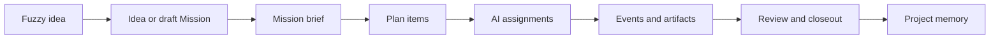

# Mission Workbench P0 Product Spec

Date: 2026-05-20
Status: Draft for product review
Scope: Origin desktop personal AI collaboration workflow

## 1. Product Decision

Origin P0 should converge on one product loop: **Mission Workbench**.

The core promise is:

> Turn a fuzzy idea into a bounded Mission, launch coordinated AI work, keep moving toward a deliverable, and leave a reviewable record.

This is not a generic chat tool, an agent marketplace, or a cloud collaboration suite. P0 serves one local desktop user who wants a reliable way to push one piece of work from vague intent to usable output.

## 2. Why This Direction

Origin already has the right product objects: Project v12, Idea, Mission, MissionPlanItem, MissionAssignment, MissionEvent, Council/Meeting, ToolBinding, Skill, and project memory. P0 should not create a parallel "AI project management system". It should connect these objects into a single end-to-end workflow.

| Route | Strength | Product Risk | Decision |
| --- | --- | --- | --- |
| Chat-first workspace | Fastest to demo and familiar to users | Important context, tasks, outputs, and decisions get buried in conversation history | Not enough for the core scenario |
| Agent-orchestration-first platform | Exciting and differentiated | Runtime, safety, UI, and capability assumptions become too large for P0 | Push to later phases |
| Mission-first workbench | Matches existing domain model and supports execution records | Requires disciplined scope control | Use for P0 |

## 3. Target User

The P0 user is the owner of a local Origin workspace. They may use Codex, Claude, browsers, local files, repos, and design tools, but they need Origin to answer a simpler question:

> What are we trying to finish, who is working on what, what happened, what is the current result, and what should be remembered?

The user is not asking for a team SaaS product. They are asking for a personal operating surface for AI-assisted work.

## 4. Core Scenario

The single P0 scenario:

1. The user captures a fuzzy thought.
2. Origin helps convert it into a Mission brief.
3. Origin creates a small plan with reviewable steps.
4. The user launches one or more AI assignments against those steps.
5. Origin tracks progress, blockers, outputs, and decisions.
6. The user closes the Mission with a deliverable, evidence, and a recap.
7. The recap is available for future work through the project record or memory surface.

## 5. Product Model

P0 should make the following objects visible and connected:

| Object | P0 Role |
| --- | --- |
| Project | Long-running workspace boundary. Holds context, memory, and all Missions for a topic or repo. |
| Idea | Low-friction capture for fuzzy thoughts. Can be promoted into a Mission. |
| Mission | The unit of execution. Contains the brief, outcome, status, risk, execution mode, plan, assignments, and event log. |
| MissionPlanItem | The smallest reviewable work unit. Uses the existing phases: plan, execute, verify, ship. |
| MissionAssignment | A concrete AI work attempt tied to a Mission and optionally a plan item, task, or issue. |
| MissionEvent | The audit trail: plan changes, assignment starts, outputs, decisions, blockers, and closeout. |
| Council / Meeting | Structured discussion or synthesis surface when a Mission needs multiple perspectives before action. |
| ToolBinding / Skill | Capability description for what an agent can safely do. P0 should show this as capability context, not as an unlimited automation promise. |

If the current schema does not expose separate fields for constraints, non-goals, artifacts, or closeout notes, P0 can store them through existing summary, outcome, and event payload surfaces first. Add dedicated fields only when repeated product use proves the need.

## 6. P0 User Experience

### 6.1 Start

The user must have three low-friction entry points:

1. Create a Mission directly inside a Project.
2. Promote an Idea into a Mission.
3. Create a Mission from an existing chat or meeting context when that context is already inside the Project workspace.

The create flow should ask for only the minimum:

- Mission title
- Fuzzy input or prompt
- Desired deliverable
- Constraints and non-goals
- Execution mode: auto, confirm, or step confirm
- Risk level: low, medium, or high

### 6.2 Clarify

After creation, the Mission detail should show a concise Mission brief:

- What are we trying to deliver?
- What counts as done?
- What is out of scope?
- What context should agents use?
- What should require user confirmation?

This brief is the control surface. It should be editable before and during execution.

### 6.3 Plan

The Mission plan should be a compact board or list grouped by phase:

- Plan
- Execute
- Verify
- Ship

Each plan item needs:

- Title
- Status
- Priority
- Risk level
- Assigned agent or pending assignment
- Latest event or output summary

P0 should favor small, reviewable plan items over a large generated plan.

### 6.4 Dispatch

The user should be able to launch an assignment from a plan item.

Assignment launch should make boundaries explicit:

- Agent or skill selected
- Work prompt
- Files, project context, or meeting context included
- Confirmation mode
- Expected output

P0 must not imply that every agent can edit files, run shell commands, use browsers, or access external services. The UI should describe available capability based on the existing ToolBinding or Skill surface.

### 6.5 Monitor

The Mission detail needs a status strip:

- Current Mission status
- Running assignments
- Blocked items
- Latest output
- Next suggested action

The event log should be readable as a work history, not raw telemetry. High-value events should be visible by default; noisy runtime details should collapse behind a secondary view.

### 6.6 Review And Close

The closeout flow should produce a Mission recap:

- Final deliverable
- Evidence or linked artifacts
- Decisions made
- Open issues
- Follow-up suggestions
- What should be remembered next time

The recap should be copyable and, where supported by existing project memory surfaces, saved back into the Project record.

## 7. P0 Scope

P0 includes:

- Project-level Mission entry point
- Idea-to-Mission promotion path
- Mission brief editor
- Mission plan grouped by plan, execute, verify, and ship
- Assignment launch from a plan item
- Assignment status and output summary
- Mission event timeline
- Closeout recap
- Minimal local persistence using existing Mission and Project surfaces
- Desktop-first interaction checks

P0 excludes:

- Cloud accounts, organization management, or multi-user collaboration
- Public agent marketplace
- Full workflow automation engine
- Unbounded autonomous shell, browser, or file-writing control
- Analytics dashboards
- Mobile-first experience
- Enterprise permissions or audit compliance
- Connector platform beyond existing ToolBinding and Skill descriptions

## 8. Success Criteria

P0 is successful when the user can complete this flow in one Project:

1. Capture a vague idea.
2. Turn it into a Mission in under three minutes.
3. Create or accept a small plan.
4. Launch at least one assignment from a plan item.
5. See assignment status and output attached to the Mission.
6. Review a readable event timeline.
7. Close the Mission with a deliverable and recap.
8. Reopen the Project later and understand what happened without rereading the whole chat.

## 9. Product Guardrails

- The Mission is the main product surface. Chat, meetings, skills, and agents are supporting surfaces.
- The UI should bias toward one active Mission rather than many parallel dashboards.
- Every assignment should connect back to a plan item or a Mission-level decision.
- Every closeout should produce a recap that can stand alone.
- Agent capability should be represented truthfully. Do not show actions that the selected runtime cannot perform.
- Local-first and desktop-first constraints remain product requirements, not implementation details.

## 10. Main Risks

| Risk | Why It Matters | P0 Mitigation |
| --- | --- | --- |
| Capability mismatch | Users may assume agents can execute local actions that the runtime cannot perform | Show selected capability clearly at assignment launch |
| Over-planning | Generated plans can become large and ignored | Keep P0 plan items small and editable |
| Timeline noise | Raw events can make review harder | Default to summarized high-value events |
| Object fragmentation | Idea, Mission, Meeting, and Project may feel like separate products | Route every surface back to the active Mission |
| Scope creep | Agent orchestration can expand into a platform too early | Keep P0 to one local user, one Project, one Mission loop |

## 11. Later Phases

P1 should deepen the loop:

- Mission templates
- Better recap-to-memory behavior
- Assignment output compression
- Mission review prompts
- Reopen or fork Mission
- Stronger Council-to-plan conversion

P2 should expand capability:

- More external connectors
- Richer agent roles
- Cross-Mission memory retrieval
- Artifact registry
- Reusable workflow patterns

P3 can revisit platform-level orchestration only after the Mission loop is reliable in daily local use.
